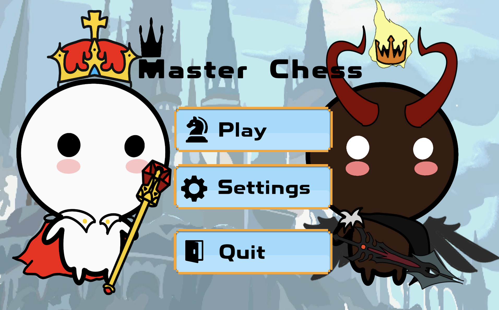
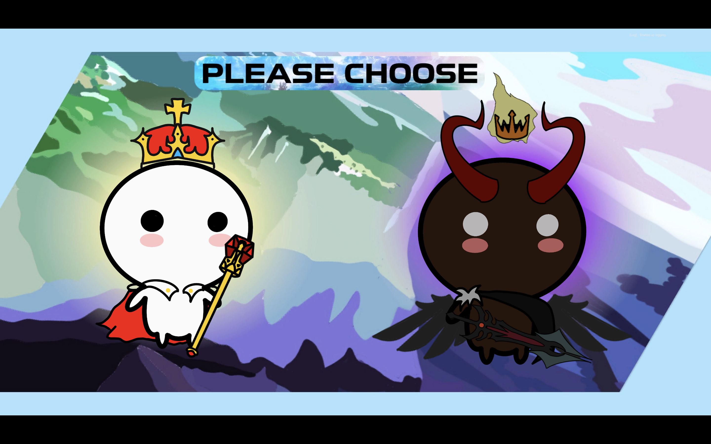

<!-- PROJECT LOGO -->
<p align="center">
  <a href="https://github.com/OOPProject-to-the-moon/2D-Chess-game-OOP-Project">
    
  </a>

<h3 align="center">Master Chess</h3>

  <p align="center">
    A 2D Chess Game built with Unity
    <br />
    <a href="https://github.com/OOPProject-to-the-moon/2D-Chess-game-OOP-Project"><strong>Explore the docs »</strong></a>
    <br />
    <br />
    <a href="https://github.com/CSCMU-65s/master-chess/tree/main/Var/Screenshot">View Demo</a>
    ·
    <a href="https://github.com/OOPProject-to-the-moon/2D-Chess-game-OOP-Project/issues">Report Bug</a>
    ·
    <a href="https://github.com/OOPProject-to-the-moon/2D-Chess-game-OOP-Project/issues">Request Feature</a>
  </p>

<!-- TABLE OF CONTENTS -->
## Table of Contents
- [About The Project](#about-the-project)
    - [Built With](#built-with)
- [Getting Started](#getting-started)
    - [Prerequisites](#prerequisites)
    - [Installation](#installation)
- [License](#license)

<!-- ABOUT THE PROJECT -->
## About The Project
Master Chess is a chess simulation game built with Unity. It allows you to play a game of chess by clicking on the pieces to move and the desired location on the board. The game continues until a King enters checkmate or there is a draw.





### Built With

* [Unity](https://unity.com) - The powerful game development platform


<!-- GETTING STARTED -->
## Getting Started

### Prerequisites
- Unity: Download and install Unity from [here](https://unity.com/download)

### Installation
1. Clone the repo
   ```sh
   git clone https://github.com/OOPProject-to-the-moon/2D-Chess-game-OOP-Project.git
   ```
2. Open project with `Unity`

<!-- LICENSE -->
## License

Distributed under the MIT License. See [LICENSE](LICENSE) for more information.

---